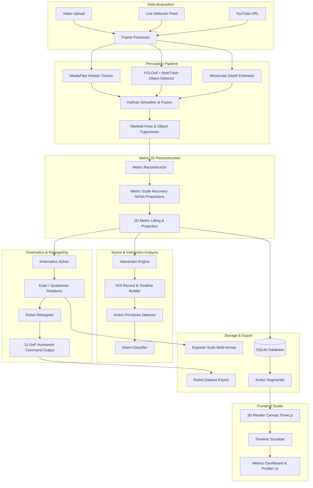

# SignVerse Robotics - System Architecture

This document details the architectural layout, pipeline processing, and representation schemas for the **SignVerse Robotics Studio** platform.

## 🎯 Vision
SignVerse is designed to address a critical bottleneck in modern robotics research: the lack of scalable, diverse, and high-fidelity human demonstration data. By converting unstructured, multi-source video content (YouTube, local uploads, or live cameras) into physics-compliant joint configurations, 3D skeletons, and metric scene reconstruction datasets, SignVerse creates a bridge between human motion and robotic reinforcement learning (RL) or imitation learning systems.

---

## System Overview Diagram

---

## Pipeline Components

### 1. Ingestion Layer
Ingests visual inputs from file uploads, live capture streams, or remote links (via `yt_dlp` and `OpenCV`). The ingestion is normalized to a target frame rate (e.g., 30 FPS) for downstream temporal consistency.

### 2. Perception & Smoothing Layer
Uses **MediaPipe Holistic** to extract 3D landmarks for body pose (33 points), left/right hands (21 points each), and face mesh contours. Concurrently, **YOLOv8** + **ByteTrack** estimates 2D bounding boxes and tracks unique objects in the scene. To eliminate capture noise and jitter, a **Temporal Kalman Filter** is applied frame-by-frame on coordinates, maintaining realistic physical inertia.

### 3. Monocular Depth & Metric 3D Reconstruction
Estimates relative depth maps using a monocular depth neural network (with zero-depth CPU fallback). The relative scale is recovered using NASA MSIS-3000 biomechanical proportions (shoulders, hip spans, heights) and typical COCO object dimensions. Scale recovery uses weighted least-squares and 2-sigma outlier rejection, after which 2D coordinate projections are back-projected into absolute metric 3D space (in meters).

### 4. Kinematic Solver Layer
Converts raw 3D position vectors into angular rotations. The underlying mathematical formulas and coordinate frames are detailed in the [Mathematical Capabilities & Engineering Principles Reference](file:///c:/Users/User/Documents/SignVerse/docs/MATH_PRINCIPLES.md).
* **Joint Directions**: Computes relative bone vectors (e.g., forearm vector relative to upper arm).
* **Euler/Quaternion Converter**: Translates joint directions into local rotation matrices, outputting Euler angles for hierarchical joints.
* **Bone Length Constraints**: Normalizes bone dimensions to guarantee consistency.

### 5. Human-to-Robot Retargeter
Maps the human body joints into a normalized joint space for an **11-Degree-of-Freedom (DoF)** humanoid model:
* `neck_yaw`
* `left_shoulder_pitch`, `left_shoulder_roll`, `left_elbow_yaw`, `left_elbow_roll`
* `right_shoulder_pitch`, `right_shoulder_roll`, `right_elbow_yaw`, `right_elbow_roll`
* `left_knee_pitch`, `right_knee_pitch`

### 6. Scene & Interaction Analysis (HOI)
Integrates skeletal landmarks and object bounding boxes to compute spatial relationships and contact points. It logs timeline events (e.g., `HOLDING`, `LIFTING`, `PLACING`) and estimates action primitives and contextual intent.

### 7. Action Segmentation Layer
Runs rule-based classifier heuristics on joint positions and velocities to merge consecutive frames into categorized actions:
* `idle`: Low motion magnitude.
* `walk`: Moderate-to-high activity with lower-body joint flexions.
* `wave`: Rapid vertical movement in wrists above shoulders.
* `arm_raise`: Wrists positioned higher than shoulders.
* `grab`: Horizontal extension of arms.
* `sit`: Knee-to-hip ratio threshold triggers.

### 8. Storage & API Layer
Stores metadata (fps, frame count, durations) and extracted joint datasets in **SQLite**. Serves raw coordinates, exported `.bvh` files, and JSON robot datasets via **FastAPI** REST endpoints.

### 9. Multi-Format Exporters
Compiles and generates animation files (BVH, FBX, GLTF, USD, etc.) for both armature-only and scene-level (animating objects alongside the armature skeleton).

### 10. System Memory Diagnostics & Profiling
A continuous background profiling service utilizing `psutil` and `tracemalloc` to track RSS, VMS, Python heap objects, and request latencies. It automatically triggers regression-based alerts upon memory leak detection and exposes `/api/profiling` endpoints linked directly to a diagnostics UI panel.

---

## 🛠️ Technology Stack
* **Backend Framework**: FastAPI (Uvicorn server)
* **Database**: SQLite (SQLAlchemy ORM)
* **Perception Engine**: MediaPipe Holistic Tracker, YOLOv8 Object Detector, ByteTrack
* **Mathematics & Optimization**: NumPy, SciPy
* **Frontend Framework**: React v18 (Vite compiler, Zustand state management, Axios clients)
* **3D Visualizer Engine**: Three.js (@react-three/fiber, @react-three/drei WebGL wrapper)
