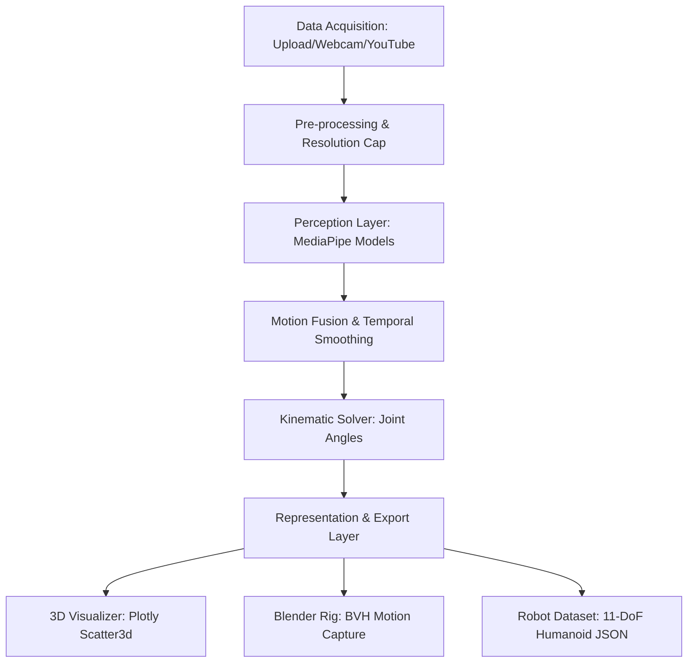

# SignVerse Robotics - System Architecture

This document details the architectural layout, pipeline processing, and representation schemas for the **SignVerse Robotics Studio** platform.

## 🎯 Vision
SignVerse is designed to address a critical bottleneck in modern robotics research: the lack of scalable, diverse, and high-fidelity human demonstration data. By converting unstructured, multi-source video content (YouTube, local uploads, or live cameras) into physics-compliant joint configurations and 3D skeletons, SignVerse creates a bridge between human motion and robotic reinforcement learning (RL) or imitation learning systems.

---

## 🏗️ Core Architectural Layers (MVP Specification)

### 1. Input & Ingestion Layer
* **Data Sources**: Uploaded video files (MP4, AVI, MOV), live local webcams, and automated YouTube downloads via `yt_dlp`.
* **Resolution Control**: Standardizes input resolution (throttles YouTube downloads to 480p maximum) to minimize network consumption and speed up computational frame rates.
* **Frame Extraction**: Sequential extraction via OpenCV video capture buffers.

### 2. Perception Layer (MediaPipe Integration)
Extracts a total of **569 keypoint landmarks** per frame:
* **Pose Estimation**: 33 full-body landmarks (shoulders, hips, elbows, wrists, knees, ankles, feet).
* **Hand Tracking**: 21 coordinates for the left hand and 21 for the right hand, covering joints and fingertips.
* **Facial Geometry**: 90 handpicked expressive landmarks (lip outline, eyes, eyebrows, nose) to capture emotion and facial expressions efficiently.

### 3. Motion Fusion & Smoothing Layer
* **Temporal EMA Filter**: Coordinates are smoothed across consecutive frames using an Exponential Moving Average (EMA) filter:
  $$S_t = \alpha Y_t + (1 - \alpha) S_{t-1}$$
* **Purpose**: Removes high-frequency jitter caused by camera noise, low lighting, or model estimation fluctuations, preserving motion dynamics without introducing delay.

### 4. Kinematic Representation Layer
* **Joint Angle Solver**: Calculates anatomical joint flexion and extension using 3D vector dot products.
* **Mathematical Mappings**: Derivations for the coordinate system conversions, quaternions, filters, forward/inverse kinematic solvers, and validation metrics are documented in the [Mathematical Capabilities & Engineering Principles Reference](file:///c:/Users/User/Documents/SignVerse/docs/MATH_PRINCIPLES.md).
* **Pairs Tracked**:
  * **Shoulder Pitch**: Hip-Shoulder-Elbow angle.
  * **Shoulder Roll**: Hip-Shoulder-Elbow abduction rotation.
  * **Elbow Flexion**: Shoulder-Elbow-Wrist angle.
  * **Hip Flexion**: Shoulder-Hip-Knee angle.
  * **Knee Flexion**: Hip-Knee-Ankle angle.

### 5. Render & Export Layer
* **Plotly 3D engine**: Draws joints as Scatter3d markers. To prevent browser lock-up, the visualizer uses coordinate concatenation separated by `None` elements to render all skeletal connections in a single draw-call trace.
* **Blender Export**: Generates `.bvh` files formatting hierarchical skeletons and orientation rotations.
* **Robot Dataset Export**: Generates JSON datasets with joint trajectories mapped to a standard 11-Degrees of Freedom (DoF) humanoid robot configuration in radians.

---

## 🛠️ Technology Stack
* **Language**: Python 3.10+
* **Perception Engine**: Google MediaPipe (Pose, Hands, Face Mesh APIs)
* **Ingestion Backend**: OpenCV, `yt_dlp`
* **Mathematical Operations**: NumPy
* **Interactive Frontend**: Streamlit (Premium Custom dark glassmorphism theme)
* **3D Visualizer Engine**: Plotly (Scatter3d WebGL wrapper)
