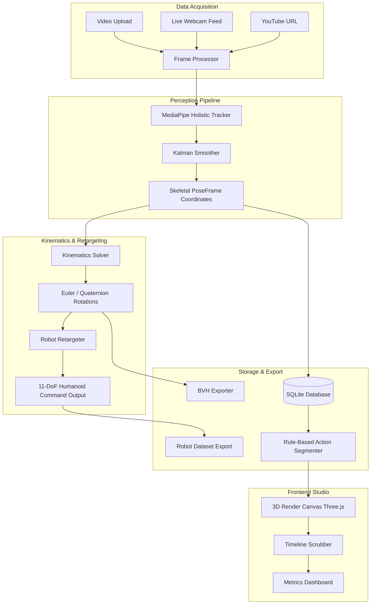

# SignVerse Robotics System Architecture

This document outlines the end-to-end architecture of the **SignVerse Robotics** platform, a system designed to translate raw human motion capture sequences (from video uploads, YouTube streams, or live cameras) into smoothed 3D trajectories, retargeted joint angles for humanoid robot models, and standardized animation assets.

---

## System Overview Diagram

---

## Pipeline Components

### 1. Ingestion Layer
Ingests visual inputs from file uploads, live capture streams, or remote links (via `yt_dlp` and `OpenCV`). The ingestion is normalized to a target frame rate (e.g., 30 FPS) for downstream temporal consistency.

### 2. Perception & Smoothing Layer
Uses **MediaPipe Holistic** to extract 3D landmarks for body pose (33 points), left/right hands (21 points each), and face mesh contours.
To eliminate capture noise and jitter, a **Temporal Kalman Filter** is applied frame-by-frame on coordinates, maintaining realistic physical inertia.

### 3. Kinematic Solver Layer
Converts raw 3D position vectors into angular rotations. The underlying mathematical formulas and coordinate frames are detailed in the [Mathematical Capabilities & Engineering Principles Reference](file:///c:/Users/User/Documents/SignVerse/docs/MATH_PRINCIPLES.md).
* **Joint Directions**: Computes relative bone vectors (e.g., forearm vector relative to upper arm).
* **Euler/Quaternion Converter**: Translates joint directions into local rotation matrices, outputting Euler angles for hierarchical joints.
* **Bone Length Constraints**: Normalizes bone dimensions to guarantee consistency.

### 4. Human-to-Robot Retargeter
Maps the human body joints into a normalized joint space for an **11-Degree-of-Freedom (DoF)** humanoid model:
* `neck_yaw`
* `left_shoulder_pitch`, `left_shoulder_roll`, `left_elbow_yaw`, `left_elbow_roll`
* `right_shoulder_pitch`, `right_shoulder_roll`, `right_elbow_yaw`, `right_elbow_roll`
* `left_knee_pitch`, `right_knee_pitch`

### 5. Action Segmentation Layer
Runs rule-based classifier heuristics on joint positions and velocities to merge consecutive frames into categorized actions:
* `idle`: Low motion magnitude.
* `walk`: Moderate-to-high activity with lower-body joint flexions.
* `wave`: Rapid vertical movement in wrists above shoulders.
* `arm_raise`: Wrists positioned higher than shoulders.
* `grab`: Horizontal extension of arms.
* `sit`: Knee-to-hip ratio threshold triggers.

### 6. Storage & API Layer
Stores metadata (fps, frame count, durations) and extracted joint datasets in **SQLite**. Serves raw coordinates, exported `.bvh` files, and JSON robot datasets via **FastAPI** REST endpoints.
